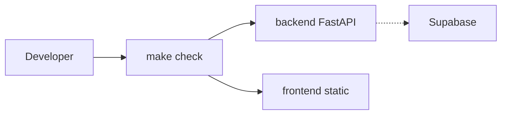

# Ballotbox repository bootstrap

## Layout (monorepo)

```
ballotbox/
  backend/                 # Python API (local: ASGI; deploy: Lambda)
    pyproject.toml         # uv, ruff, mypy, runtime + dev deps
    src/ballotbox/         # package root (typed)
    Dockerfile
  frontend/                # SvelteKit + adapter-static (S3-friendly)
    package.json
    svelte.config.js
    vite.config.ts
    Dockerfile             # build + nginx (or serve) static
  docker-compose.yml
  Makefile
  .gitignore               # includes .env, .venv, __pycache__, node_modules, dist, etc.
  .env.example             # SUPABASE_* placeholders (no secrets)
  README.md                # how to run: uv, docker, make check
  .cursor/
    rules/verify-quality.mdc
    hooks.json             # optional: run make check on agent stop
    hooks/run-make-check.sh
```

## Python backend

- **Tooling**: [uv](https://github.com/astral-sh/uv) as the only install path documented (`uv sync`). Pin a **single** Python version in `pyproject.toml` (`requires-python`) and in Docker; use the **newest Lambda-supported** runtime (verify at deploy time—e.g. 3.12 or 3.13—[AWS Lambda runtimes](https://docs.aws.amazon.com/lambda/latest/dg/lambda-runtimes.html)).
- **API shape**: [FastAPI](https://fastapi.tiangolo.com/) + [Mangum](https://github.com/Kludex/mangum) so the same app runs under Uvicorn locally/Compose and mounts cleanly on API Gateway + Lambda. A minimal `GET /health` proves wiring.
- **Supabase**: Add `supabase` (official client). Load `SUPABASE_URL` and `SUPABASE_KEY` (or service role name you prefer) from environment—no secrets in code. Document vars in [`.env.example`](.env.example); real values only in [`.env`](.env) (gitignored).
- **Lint / types**: **Ruff** (lint + format, replace separate isort/black), **mypy** with strict-ish defaults gradually (start with `strict = true` on `src/` or equivalent package path). Optional `pyproject.toml` `[tool.ruff]` and `[tool.mypy]` aligned with `src` layout.
- **Tests**: `pytest` + `httpx` AsyncClient for API tests (minimal one test for `/health`).

## Frontend (Svelte, static/S3)

- **Stack**: **SvelteKit** with **[adapter-static](https://kit.svelte.dev/docs/adapter-static)** so `npm run build` emits a static `build/` (or configured output) suitable for S3 + CloudFront. Prerender a simple **Hello World** page with a bit of static copy.
- **Quality gates from day one**:
  - **Typecheck**: `svelte-check` (and TypeScript in `check` script).
  - **Lint**: ESLint with `eslint-plugin-svelte` + TypeScript parser.
  - **Tests**: Vitest + `@testing-library/svelte` (or `@testing-library/svelte` + jsdom)—one smoke test that mounts the page or checks a heading.
- **Lockfile**: `package-lock.json` (npm) or `pnpm-lock.yaml` if you prefer pnpm—pick one and document in README; default assumption **npm** for widest compatibility with Docker.

## Makefile (root)

Single entry point for humans and CI:

| Target | Purpose |
|--------|---------|
| `make install` | `uv sync` in backend; `npm ci` in frontend |
| `make lint` | `ruff check` backend; `eslint` frontend |
| `make format` | `ruff format` backend (optional `prettier` frontend if added) |
| `make typecheck` | `mypy` backend; `svelte-check` frontend |
| `make test` | `pytest` backend; `vitest run` frontend |
| `make check` | `lint` + `typecheck` + `test` (the **bar** for “done”) |
| `make docker-build` / `make up` | Build images; `docker compose up` |

Use **recursive make** or `$(MAKE) -C backend …` patterns to keep backend/frontend Makefiles optional (simplest: all commands in root Makefile with `cd backend && uv run …`).

## Docker and Compose

- **Backend image**: Base image matching pinned Python version; install with `uv sync --frozen` (requires committed `uv.lock`). CMD: `uv run uvicorn ballotbox.main:app --host 0.0.0.0 --port 8000` (adjust import path to match package).
- **Frontend image**: Multi-stage: Node build (`npm ci && npm run build`), then **nginx** (or `caddy`) serving the static output directory—mirrors “upload folder to S3” behavior.
- **docker-compose.yml**: Services `api` (backend) and `web` (frontend), `api` exposes `8000`, `web` exposes `80` or `4173` depending on nginx config; optional `env_file: .env` for `api` so Supabase vars inject locally without baking into the image.

## Git ignore

Ensure [`.gitignore`](.gitignore) includes at minimum: `.env`, `.env.*`, `__pycache__/`, `.venv/`, `uv.lock` is **committed** (standard for reproducible uv projects), `node_modules/`, `frontend/build` or SvelteKit output, `.svelte-kit/`, coverage artifacts.

## Cursor: rules + “after agent” verification

1. **Rule** ([`.cursor/rules/verify-quality.mdc`](.cursor/rules/verify-quality.mdc)): `alwaysApply: true`. Instructs the agent: after substantive edits, run `make check` (or the minimal subset if only one side changed); fix failures before finishing; do not commit secrets.
2. **Hook** (optional but matches “after the agent has finished”): Project [`.cursor/hooks.json`](.cursor/hooks.json) with a `stop` event running [`.cursor/hooks/run-make-check.sh`](.cursor/hooks/run-make-check.sh) that executes `make check` from repo root and exits non-zero on failure so you see failures in the hook output. **Note**: This runs on every agent stop and can be slow; the rule alone may be enough. You can start with **rule only**, then add the hook if you want enforcement.

## README updates

Brief sections: prerequisites (Docker, uv, Node LTS), copy `.env.example` → `.env`, `make install`, `make check`, `docker compose up`, and a one-line note that production frontend is `build/` → S3 and backend is Lambda + API Gateway + Mangum handler.

## Dependency diagram



## Out of scope (later)

- Terraform/CDK for Lambda + S3 + IAM
- GitHub Actions CI (easy follow-up: run `make check` on PR)
- Auth flows against Supabase
